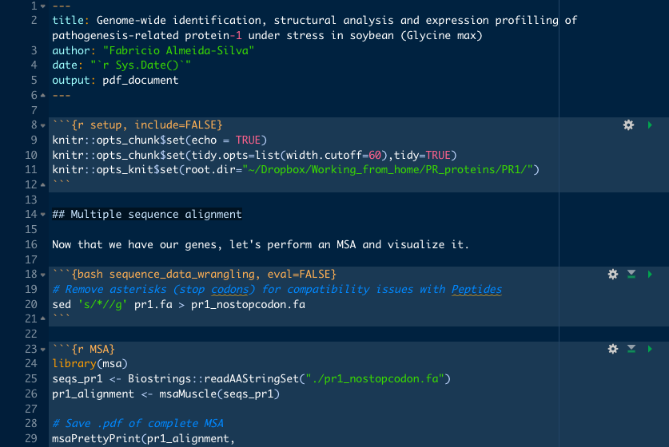
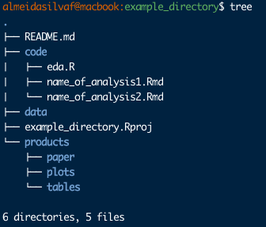

```{r setup, include=FALSE}
knitr::opts_chunk$set(
  echo = FALSE, warning = FALSE, message = FALSE,
  fig.width = 7, fig.height = 2.5
)
options(htmltools.dir.version = TRUE)
```

## Why should you manage your project?

To ensure that: 
- `r emo::ji("sync")` Your research is reproducible

--

- `r emo::ji("1")`  Your future self can **understand exactly** what you've done

--

- `r emo::ji("writing_hand")`  You can write your paper more easily 

---

class: inverse, middle, center

# #1: Document everything with R Markdown

---

## Using R Markdown

```{r xaringan-panelset, echo=FALSE}
xaringanExtra::use_panelset()
```


.panelset[
.panel[.panel-name[Definition]

- An authoring framework for data science that allows you to:

1. Write text and code in a single document

2. Generate high quality reports **with evaluated code**

3. Write code chunks in R and other languages (e.g., Python and Bash)

- .Rmd files can be created with *File* > *New File* > *R Markdown...*

]
.panel[.panel-name[.Rmd structure]

.pull-left[
```{r structure, echo=FALSE}

```
]
.pull-right[
- YAML header
- Markdown:
  1. Text
  2. R and Bash code chunks
]

]

.panel[.panel-name[Code chunk]
````markdown
```{r count_penguins, message=FALSE, warning=FALSE}`r ''`
library(tidyverse)
library(palmerpenguins)
penguins %>% 
  count(species)
```
````
]
.panel[.panel-name[Chunk output]
```{r}
suppressPackageStartupMessages(library(tidyverse))
suppressPackageStartupMessages(library(palmerpenguins))
penguins %>% 
  count(species)
```
]

.panel[.panel-name[Tips]
.pull-left[
`r emo::ji("grinning_face")`  DO:
- Label **all code chunks**
- Use inline code to ensure automatic updates
- Add session info at the end of every document
]

.pull-right[
`r emo::ji("frowning_face")`  DON'T:
- Write long .Rmd documents
]

]
]

---

class: inverse, middle, center

# #2: Structure your project directories
with RStudio projects

---

## Project structure

```{r xaringan-panelset2, echo=FALSE}
xaringanExtra::use_panelset()
```

.panelset[
.panel[.panel-name[RStudio projects]
- Create projects with *File* > *New Project...*

`r emo::ji("grinning_face")`  ADVANTAGES:
1. All code files open at once
2. Easy data import and export
3. You won't waste your time looking for that old .R file you wrote months ago
]

.panel[.panel-name[RStudio + Github]
To sync your project with GitHub for version control:
1. Create a GitHub repo
2. In RStudio, go to *File* > *New Project* >  *Version control* > *Git* and paste your repo **URL** and **name**
]

.panel[.panel-name[Directory tree]
.pull-left[
```{r dir_tree, echo=FALSE, fig.align='center'}

```
]
.pull-right[
How I structure my projects (this is very personal):
- **README.md:** detailed project description. If possible, include objectives
- **code:** .Rmd reports and .R code for EDA and data acquisition 
- **data:** data used in the analyses
- **products:** result files, figures, tables and paper
]
]

]

---

class: inverse, center, middle

# #3: Use file naming conventions

---

## Naming files

```{r xaringanxtra-panelset3, echo=FALSE}
xaringanExtra::use_panelset()
```

.panelset[

.panel[.panel-name[Principles]

According to [Jenny Brian's convention](http://www2.stat.duke.edu/~rcs46/lectures_2015/01-markdown-git/slides/naming-slides/naming-slides.pdf), file names should be:
- Machine readable
- Human readable
- Nicely ordered
]

.panel[.panel-name[Machine readable]

- Avoid spaces

.center[`r emo::ji("prohibited")`  expression analysis.R  `r emo::ji("check")`  expression_analysis.R]

- Avoid special characters (punctuation, accented characters)

.center[`r emo::ji("prohibited")`  fabricio's_report.Rmd  `r emo::ji("check")`  fabricios_report.R]

- Avoid case sensitivity

.center[`r emo::ji("prohibited")`  PromoterAnalysis.Rmd  `r emo::ji("check")`  promoter_analysis.R]

- Use delimiters

.center[`r emo::ji("prohibited")`  scatterplotpc1vspc2.png  `r emo::ji("check")`  scatterplot_pc1_vs_pc2.png]

]

.panel[.panel-name[Human readable]

- File names should describe the file content.

.center[`r emo::ji("prohibited")`  analysis1.Rmd]
.center[`r emo::ji("check")`  01_extract_genomic_ranges_overlap.Rmd]

]

.panel[.panel-name[Be nicely ordered]

- Use ISO 8601 convention for dates (YYYY-MM-DD)

.center[`r emo::ji("prohibited")`  02-20-2021_number_of_samples.png `r emo::ji("check")`  2021-02-20_number_of_samples.png]


- Left-pad numbers with zeroes

.center[`r emo::ji("prohibited")`  supplementary_fig_1.pdf  `r emo::ji("check")`  supplementary_fig_01.pdf]


]

]

---

class: inverse, center, middle

# #4: Always back up your files

---

## Backing up files

Simple and very underestimated project management task to avoid losing important files (or even directories).

--


.blockquote[`r emo::ji("crossed_fingers")`  *"This is pretty rare. It will never happen to me."*
.right[-Person who accidentally deleted important files 2 days later]
]

Don't count on it. It will.

--


Best practices:
- Syncing with a `r icon::fontawesome("github")`  repo.
- Working inside your Dropbox directory.

---

class: inverse, middle, center

# #5: Save your data in a tidy format

---

## Tidy data

.panelset[

.panel[.panel-name[Definition]
```{r tidy1, echo=FALSE, out.width='75%', fig.align='center'}
knitr::include_graphics("figs/tidydata_1.jpg")
```
]

.panel[.panel-name[Benefits]
```{r tidy2, echo=FALSE, out.width='75%', fig.align='center'}
knitr::include_graphics("figs/tidydata_2.jpg")
```
]

.panel[.panel-name[Storing tidy data]
Main guidelines according to [Karl Broman and Kara Woo](https://peerj.com/preprints/3183/):
- No empty cells
- Put only one thing in a cell
- Don't use font color or highlighting
- Save files as plain text (.txt, .tsv, .csv)

]

.panel[.panel-name[Optimizing storage]
Personal advice for R users to optimize data storage (this is what I do):
- Save tidy data as compressed .rda objects

```{r save_data, eval=FALSE, echo=TRUE}
save(expression_matrix, file="filtered_expression_matrix.rda", compress="xz")
```

`r emo::ji("grinning_face")`  ADVANTAGES:
- Reduced disk usage (e.g., large data frames)
- Faster loading with `load("object_name")` 
]

]

---

class: inverse, center, middle

# #6: Have a reading routine

---

## Reading routine

.pull-left[

- Reading papers keeps you up to date


- Consistency is the key (*e.g.*, 4 papers a week)


- Avoid open tab procrastination

]

--

.pull-right[
<blockquote class="twitter-tweet"><p lang="en" dir="ltr">It’s really important to stay on top of the literature in your field. Here’s my approach:<br><br>1. See an interesting paper, open in a web browser.<br>2. Start to read, but get distracted, leave for later.<br>3. Find a new study, open that one.<br>4. Have too many tabs open, close all.</p>&mdash; Matthew Fox (@ProfMattFox) <a href="https://twitter.com/ProfMattFox/status/1364652227395276804?ref_src=twsrc%5Etfw">February 24, 2021</a></blockquote> <script async src="https://platform.twitter.com/widgets.js" charset="utf-8"></script>
]

---

class: inverse, center, middle

# Summary

--- 

#### 1. Document everything with R Markdown
#### 2. Structure your project directories
#### 3. Use file naming conventions
#### 4. Always back up your files
#### 5. Save your data in a tidy format
#### 6. Have a reading routine

---

class: sydney-yellow, middle, center

## Here's where you can find me:

`r icon::fontawesome("twitter")`  [@almeidasilvaf](https://twitter.com/almeidasilvaf)

`r icon::fontawesome("github")`  [almeidasilvaf](https://github.com/almeidasilvaf/)

`r icon::fontawesome("globe")`  [almeidasilvaf.github.io/almeida-silvaf](https://almeidasilvaf.github.io/almeida-silvaf/)

`r icon::fontawesome("envelope")`  [fabricio_almeidasilva@hotmail.com](mailto:fabricio_almeidasilva@hotmail.com)

`r icon::academicons("orcid")`  [Fabricio Almeida-Silva](https://orcid.org/0000-0002-5314-2964)

